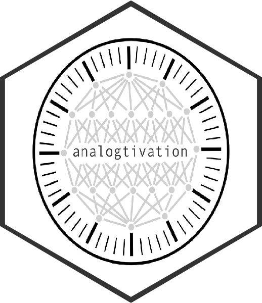

<!-- README.md is generated from README.Rmd. Please edit that file -->

```{r, include = FALSE}
knitr::opts_chunk$set(
  collapse = TRUE,
  comment = "#>",
  fig.path = "man/figures/README-",
  out.width = "100%"
)
```

# analogtivation 

<!-- badges: start -->
`r badger::badge_lifecycle("experimental")`
`r badger::badge_devel("rtjohnson12/analogtivation", "blue")`
<!-- badges: end -->

The goal of analogtivation is to ...

## Installation

You can install the development version from [GitHub](https://github.com/) with:

``` r
# install.packages("devtools")
devtools::install_github("rtjohnson12/analogtivation")
```
## Example

This is a basic example which shows you how to solve a common problem:

```{r example, eval = FALSE}
library(analogtivation)

```
