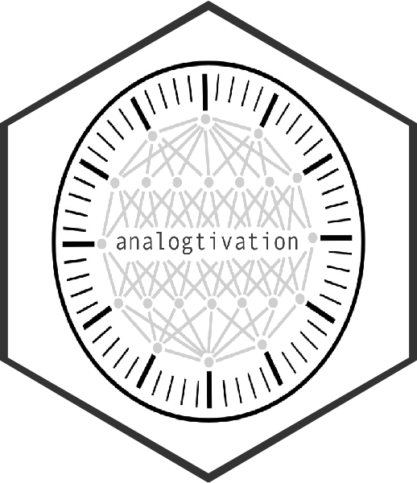

# analogtivation 

[](https://www.tidyverse.org/lifecycle/#experimental)
[](https://github.com/rio-sanjuan/analogtivation)
[](https://www.python.org/)
[](https://www.r-project.org/)

## Overview

**analogtivation** is a collection of creative and unconventional activation functions for neural networks. Originally inspired by analog clocks, this library now provides a variety of time-based, physics-inspired, and mathematically quirky activation functions for deep learning experiments.

## Why analogtivation?

Traditional activation functions like ReLU, sigmoid, and tanh are great, but what if your neural network could tell time? Or respond to the phases of the moon? Or activate based on mathematical chaos? This library explores the wild side of activation functions, perfect for:

- Research into novel activation behaviors
- Creative AI art projects
- Educational demonstrations
- Breaking out of conventional thinking in deep learning

## Features

- 🕐 **Clock Activation**: The original time-based activation that changes behavior based on current time
- 🌊 **Wave Functions**: Sinusoidal and complex waveform activations
- 🎲 **Stochastic Activations**: Probabilistic activation functions
- 🌀 **Chaos Functions**: Activation functions based on chaotic systems
- 📊 **Adaptive Functions**: Activations that learn and adapt during training

## Installation

### Python

```bash
pip install analogtivation
```

### R

```r
# From CRAN (coming soon)
install.packages("analogtivation")

# Development version from GitHub
devtools::install_github("rio-sanjuan/analogtivation")
```

## Quick Start

### Python

```python
import analogtivation as atv
import tensorflow as tf

# Use clock activation in a Keras model
model = tf.keras.Sequential([
    tf.keras.layers.Dense(64, activation=atv.clock_activation),
    tf.keras.layers.Dense(10, activation='softmax')
])

# PyTorch example
import torch
import analogtivation.torch as atv_torch

class ClockNet(torch.nn.Module):
    def __init__(self):
        super().__init__()
        self.fc1 = torch.nn.Linear(784, 64)
        self.clock = atv_torch.ClockActivation()
        self.fc2 = torch.nn.Linear(64, 10)

    def forward(self, x):
        x = self.clock(self.fc1(x))
        return self.fc2(x)
```

### R

```r
library(analogtivation)
library(keras)

# Use clock activation in keras model
model <- keras_model_sequential() %>%
  layer_dense(units = 64, activation = clock_activation) %>%
  layer_dense(units = 10, activation = 'softmax')

# Using with torch for R
library(torch)
clock_layer <- nn_clock_activation()
```

## Available Activation Functions

### Time-Based
- `clock_activation`: Changes behavior based on system clock
- `seasonal_activation`: Varies with time of year
- `circadian_activation`: 24-hour cycle activation

### Wave-Based
- `wave_activation`: Composite waveform activation
- `fourier_activation`: Frequency-domain activation
- `quantum_activation`: Quantum-inspired probabilistic activation

### Chaos-Based
- `lorenz_activation`: Based on Lorenz attractor
- `mandelbrot_activation`: Fractal-based activation
- `logistic_map_activation`: Chaotic map activation

### Adaptive
- `learning_activation`: Learns optimal activation during training
- `meta_activation`: Activation that adapts to input statistics

## Documentation

Full documentation available at [https://analogtivation.readthedocs.io](https://analogtivation.readthedocs.io)

## Contributing

We welcome contributions! See [CONTRIBUTING.md](CONTRIBUTING.md) for guidelines.

## Citation

If you use analogtivation in your research, please cite:

```bibtex
@software{analogtivation,
  author = {Johnson, Ryan},
  title = {analogtivation: Creative Activation Functions for Deep Learning},
  year = {2024},
  url = {https://github.com/rtjohnson12/analogtivation}
}
```

## Project Structure

```
analogtivation/
├── python/                 # Python package
│   ├── analogtivation/     # Main package with core, tensorflow, torch, jax modules
│   ├── tests/              # Python tests
│   └── setup.py            # Python package configuration
├── R/                      # R package
│   ├── R/                  # R source files (activations.R, draw.R)
│   ├── tests/              # R tests
│   └── DESCRIPTION         # R package metadata
├── examples/               # Shared examples and notebooks
├── legacy/                 # Original implementation (preserved for reference)
└── docs/                   # Documentation
```

## Development

See [CLAUDE.md](CLAUDE.md) for detailed development guidelines and roadmap.

## License

MIT License - see [LICENSE](LICENSE) file for details.

## Acknowledgments

- Original clock activation concept inspired by the question: "What if neural networks could tell time?"
- Thanks to all contributors who have added their own creative activation functions
- Special thanks to the deep learning community for embracing unconventional ideas
