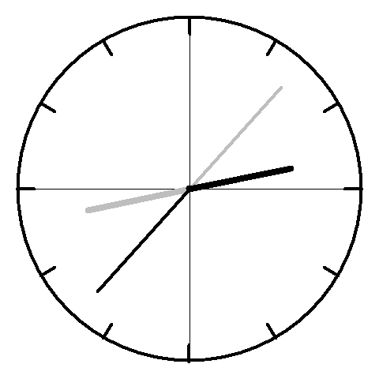

# Analogtivation
Exploring a silly activation function for neural networks.

## Background

The core idea of this project is to create an activation function based on the hands of a clock. Whenever the activation function is called, a clock is "drawn" based on the current Greenwich Mean Time (GMT). For simplicity, negative values use the hour hand of the clock and positive values use the minute hand of the clock (Unlike a regular clock, the two hands extend across the full diameter as opposed to only half. I have shown this extension in gray.). In the example to the right, the activation function would behave roughly equivalently to a RELU activation function.

## Testing

To test this activation, I used a very simple architecture of 1 hidden layer with 32 neurons and trained it on the classic MNIST data set.

## Performance

Below, you can see the loss function over time for several iterations. As you can see, some times are clearly better than others.

Next, we plot several iterations individually and note activation function at that time.

